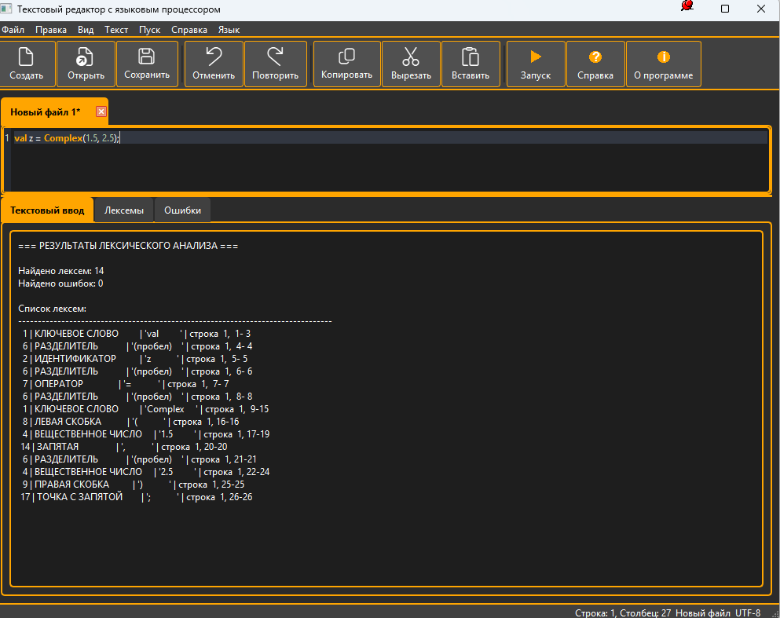
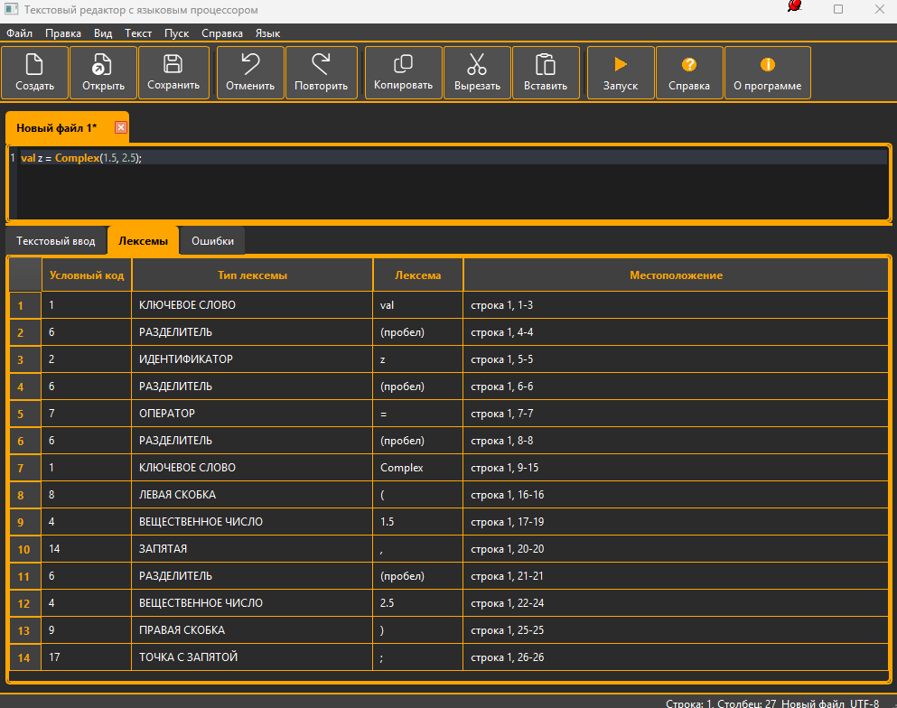
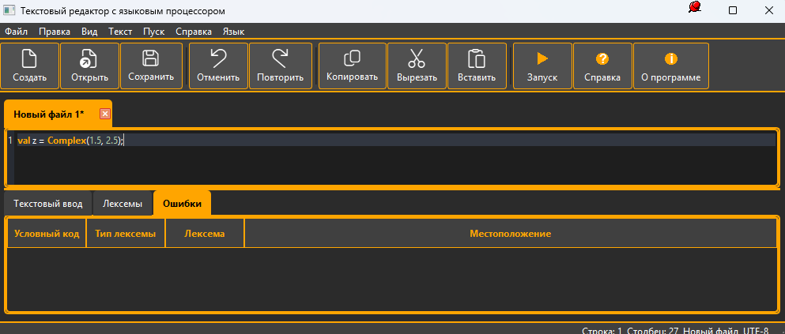
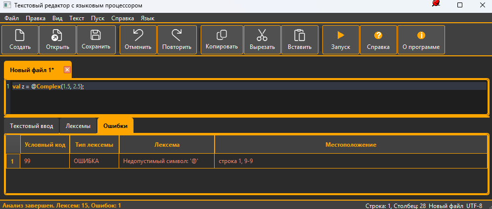

# Лабораторная работа №2: Разработка лексического анализатора (сканера)

## 1. Название и цель работы
**Название:** Разработка лексического анализатора (сканера)
**Цель работы:** Изучить назначение и принципы работы лексического анализатора в структуре компилятора. Спроектировать алгоритм (диаграмму состояний) и выполнить программную реализацию сканера для выделения лексем из входного текста. Интегрировать разработанный модуль в ранее созданный графический интерфейс языкового процессора.

## 2. Сведения об авторе
- **Студент:** Васильев Антон Романович
- **Группа:** АВТ-314
- **Вариант:** 8

## 3. Постановка задачи
Необходимо разработать лексический анализатор (сканер) в соответствии с индивидуальным вариантом задания, интегрировать его в приложение из лабораторной работы №1 и обеспечить наглядный вывод результатов в виде таблицы с условными кодами, типами, значениями лексем и их местоположением.

## 4. Вариант задания
**Текстовое описание:** Объявление комплексного числа в языке Scala.

**Перечень допустимых лексем:**
1.  **Ключевое слово:** val, var, def, class, object, new, Complex, extends, trait, import, package, private, protected, override, implicit, lazy, sealed, final, abstract, case, this, super, return, if, else, while, for, yield, match, try, catch, finally, throw, type, true, false, null.
2.  **Идентификатор:** последовательность букв латинского алфавита и цифр, начинающаяся с буквы.
3.  **Целое число:** Последовательность десятичных цифр.
4.  **Вещественное число:** Число с десятичной точкой и хотя бы одной цифрой после точки.
5.  **Мнимое число:** Число (целое или вещественное) с суффиксом i.
6.  **Разделитель (пробельный):** Пробел, табуляция, перевод строки.
7. **Оператор:** Арифметические и логические операторы.
8. **Разделитель (знак):** Скобки, запятые, двоеточие, точка с запятой.
99. **Ошибка:** Любой символ, не соответствующий допустимым типам.

**Примеры корректных входных строк:**
```scala
val z = Complex(1.5, 2.5);
```
## 5. Диаграмма состояний


## 6. Скриншоты реализованного приложения







